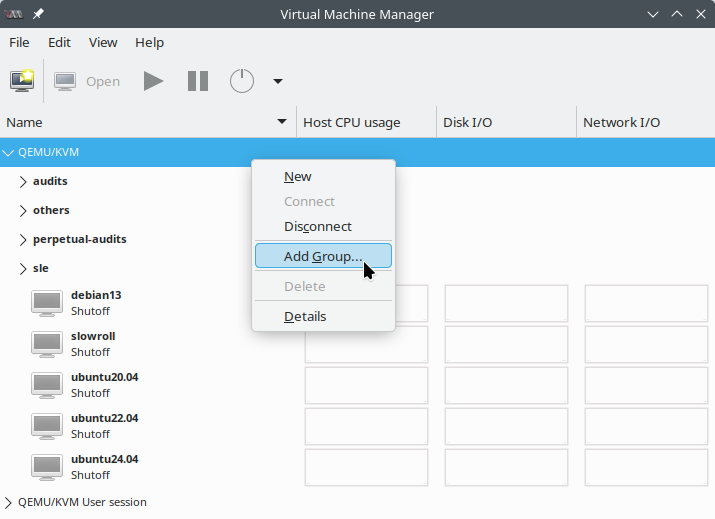

## virt-manager with groups
This vibecoded patch adds group support to virt-manager.

* Right-click on a connection
* "Add group..."
* Drag VMs into the group



### Implementation
It is designed to be non-intrusive. It merely adds a new group element to the
XML. Your VMs will continue to appear normally in `virsh` or vanilla
`virt-manager`.

```
  <metadata>
    <virt-manager:container xmlns:virt-manager="http://virt-manager.org/xmlns/virt-manager/1.0">
      <virt-manager:group>debian</virt-manager:group>
    </virt-manager:container>
  </metadata>
```

### Upstream
Upstream will likely never [adopt this](https://bugzilla.redhat.com/show_bug.cgi?id=1193303). They rejected the idea multiple times.

> We've made an explicit design decision with virt-manager to not target large numbers of VMs, so this grouping feature isn't something we want to implement.


## Original README

[Original README](../README.md)
